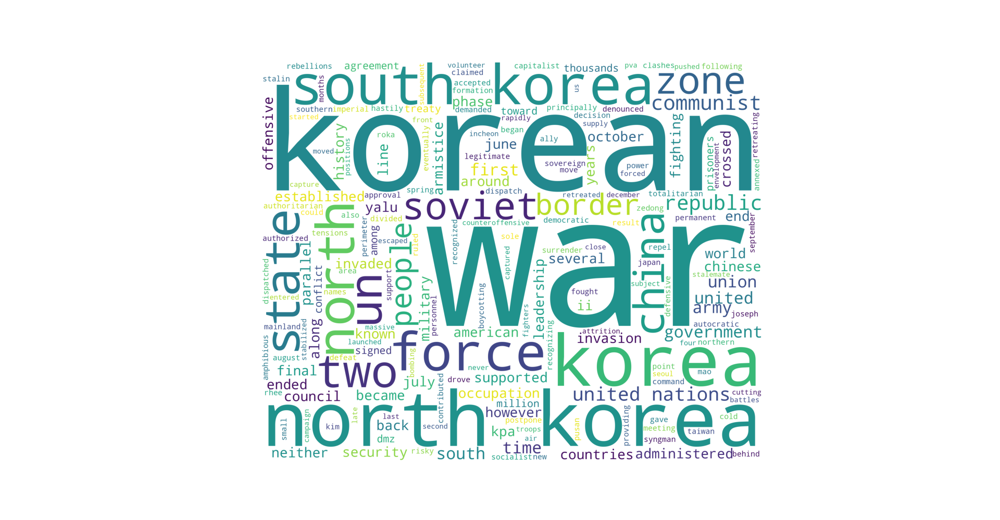

# Natural Language Processing - Word Cloud
Using Python and natural language processing, this program finds the most used words and outputs them in a word cloud.

## Install requirements
Run `pip install -r requirements.txt` to install the dependencies.

## NLTK
Run `python3 nltk-download.py` to let NLTK dowload any required assets

## Run the program
Run `python3 main.py` to run the program. You can add any text you want in the variable `korWar`.

## Sample output

